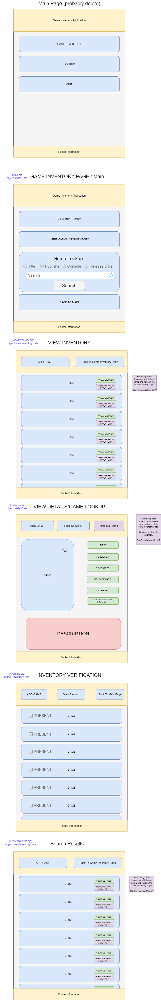

# game-inventory-app

## Version

1.0.0

## Description

Multi-Functional Game Inventory and Display System

## Authors

Tina Myers
Simon Panek
JP Jones

## Program Management

[Trello Board](https://trello.com/b/1NM9f3I7/game-inventory-app)

## Technology Used

+ NodeJs
+ Express
+ JQuery
+ Superagent
+ Cors
+ PG
+ Method Override
+ Postgres SQL

## Instructions for Use

Access the app hosted on [Heroku](https://game-inv-app.herokuapp.com/)

## API

+ [RAWG API](https://rawg.io/apidocs)
+ [RAWG API Docs](https://api.rawg.io/docs/)
+ Sample Endpoint: `GET https://api.rawg.io/api/games?key=YOUR_API_KEY&search=sonic`
+ [Sample Results](/readme_img/sample-sonic-rawg-search-results.pdf)

## Database Schema

[Database Schema](/readme_img/game-inventory-schema.png)

## Acknowledgements

### Nintendo Switch Image: Photo by [Ahmad Mohammed](https://unsplash.com/@amed10?utm_source=unsplash&amp;utm_medium=referral&amp;utm_content=creditCopyText) on Unsplash

### W3 Schools: https://www.w3schools.com/w3css/w3css_modal.asp

## Wireframe

## Problem Domain

## Database Entity Relationship Diagram

